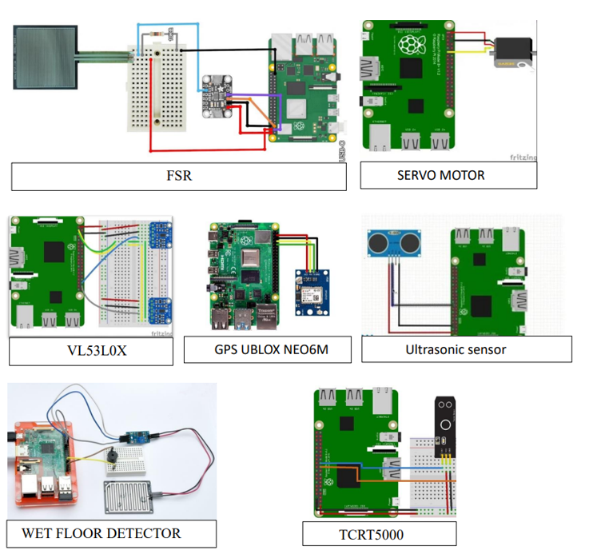
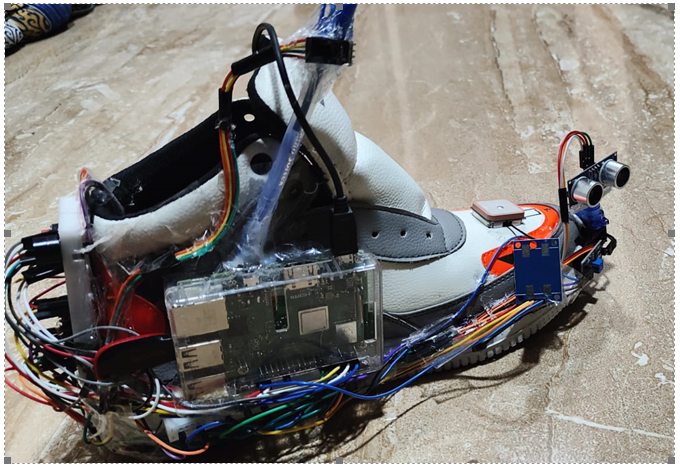

# StrideAssist - An Intelligent Shoe for the Visually Impaired

# 2nd Ranked among projects of all vit-ap students of 2022 batch


## Table of Contents
- [Introduction](#introduction)
- [Features](#features)
- [Hardware Requirements](#hardware-requirements)
- [Software Requirements](#software-requirements)
- [Circuit Diagram](#circuit-diagram)
- [Installation](#installation)
- [Usage](#usage)
- [Contributing](#contributing)
- [License](#license)
- [Acknowledgements](#acknowledgements)

## Introduction
StrideAssist is an innovative shoe designed to assist visually impaired individuals by providing real-time feedback on their surroundings. Utilizing a variety of sensors and modules, StrideAssist offers in-ear instructions about obstacles, topography changes, surface nature, and GPS address resolution. Additionally, it includes a step counter and the ability to send emergency messages to loved ones via Telegram.

## Features

- **Obstacle Detection:** Uses VL53L0X and Ultrasonic sensors to detect obstacles and provides audio feedback.
- **Surface Type Identification:** TCRT5000 sensor identifies the type of surface (e.g., plain, oil, marble).
- **Topography Changes:** VL53L0X sensor detects changes in topography, such as rises and falls.
- **Wet Floor Detection:** Raindrop sensor alerts the user about wet floors.
- **GPS Tracking:** Neo6M GPS module provides the current location and addresses via Geopy.
- **Emergency Alerts:** A button-press emergency system sends location details to predefined contacts using Telegram.
- **Step Count:** Monitors and announces the number of steps taken.
- **Buzzer Alerts**: Audible alerts for various events like wet floors and emergency activation.

## Hardware Requirements
- Raspberry Pi 3 Model B+
- VL53L0X Time-of-Flight Distance Sensor
- TCRT5000 Reflective Optical Sensor
- FSR (Force Sensitive Resistor)
- Neo-6M GPS Module
- Ultrasonic Sensor (HC-SR04)
- Servo Motor (for scanning with the ultrasonic sensor)
- Buzzer
- Push Button
- Telebot (Telegram bot) setup

## Software Requirements
- Raspbian OS
- Python 3
- Libraries: 
  - `RPi.GPIO`
  - `telebot`
  - `threading`
  - `board`
  - `busio`
  - `adafruit_vl53l0x`
  - `adafruit_ads1x15`
  - `evdev`
  - `gps`
  - `subprocess`
  - `geopy`
  - `signal`
 
    
## Classes and Functions

### FSRThread
- Monitors the force-sensitive resistor to count steps and detect when the shoe is lifted.

### TCRT5000Sensor
- Identifies the surface type based on reflectance values.

### VL53L0XSensor
- Detects topography changes like rises and falls.

### UltrasonicSensorThread
- Scans for obstacles in different directions.

### Neo6M
- Provides GPS coordinates and addresses.

### WetFloor
- Monitors for wet floor conditions.

### TWS (Tap-Walk System)
- Manages user interactions via tapping gestures.

### ShoeController
- Controls the overall functionality and responds to button presses for activation and emergency alerts.

## Getting Started

To get started with the Smart Shoe Assist, ensure you have all necessary components and sensors correctly connected and configured. Follow the steps below to run the script:

## Circuit Diagram for reference only


## Setup Instructions
### Hardware Connections:
- Connect the sensors, servo motor, buzzer, and push button to the appropriate GPIO pins on the Raspberry Pi.
- Ensure the I2C bus is enabled for connecting the VL53L0X and ADC modules.

## Installation
1. **Clone the Repository**:
    ```bash
    git clone https://github.com/yourusername/StrideAssist.git
    cd StrideAssist
    ```

2. **Install Dependencies**:
    ```bash
    pip install RPi.GPIO telebot adafruit-circuitpython-vl53l0x adafruit-circuitpython-ads1x15 evdev gps geopy
    ```

3. **Configure GPIO**:
    Ensure all the sensors and modules are properly connected to the Raspberry Pi GPIO pins as specified in the code.

## Usage
1. **Setup Telegram Bot**:
    - Create a Telegram bot and get the API token.
    - Replace the `TOKEN` and `CHAT_ID` in the `project.py` file with your bot's API token and the chat ID of the recipients.

2. **Run the Project**:
    ```bash
    python project.py
    ```

3. **Interacting with the Shoe**:
    - Press the button to start or stop the shoe functionalities.
    - Long press the button to send an emergency message.
    - The shoe will provide audio feedback through a connected earpiece.

## Contributing
Contributions are welcome! Please fork this repository and submit a pull request for any improvements or bug fixes.

## Acknowledgements
We would like to thank everyone who supported us in the development of StrideAssist. Special thanks to our mentors, family, and friends for their encouragement and assistance.

---

We hope StrideAssist will significantly enhance the mobility and independence of visually impaired individuals. If you have any questions or suggestions, feel free to open an issue or contact us directly.

## Image



